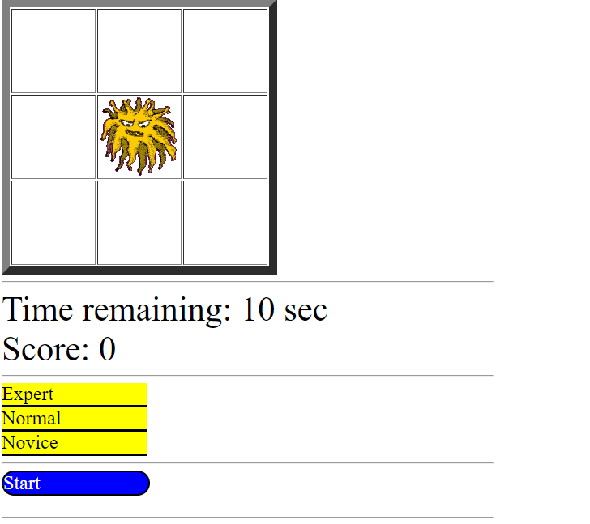

# Hammer Game
## language: HTML, CSS, JavaScript
## Browser for grading: Chrome (recommended)
## Description: 2021-f-4021-hw-1.pdf
```
COMP 4021 Internet Computing
Fall 2021 Homework 1
Due Date: See Canvas
In Lab 1, you have tried out the monster and hammer games and studied the codes. In this 
homework, you are asked to enhance the hammer game with the following additional 
functions:
1. Add 3 buttons Expert, Normal and Novice to control the speed of the monster 
movements: Normal is the speed set in the current code, Expert doubles the speed 
whereas Slow halves the speed. The buttons are implemented as 3 DIVs with "yellow" 
background color. Clicking a button changes its color to red and set the corresponding 
speed. When the game is started, set the speed to Normal. Speed is changeable when 
the game is running.
2. Add a DIV functioning as a Start/Stop button to start or stop the game at any time. 
When the page is first loaded, the game should stop, the button is labelled "Start", and 
the monster is at the center cell. Clicking the button starts the game and changes the 
label to "Stop". Clicking the button stops the game, sets the game to its initial state, and 
changes the label to "Start". 
3. Instead of using keystrokes to hit the monster, use the mouse to click the cell containing 
the monster. 
I do not expect fancy UI. You can decide reasonable sizes and positions of the buttons. 
Use the code of the monster and hammer games and extend the codes to provide the above
functions. You cannot use any framework or library; use plain JavaScript and HTML.
Grading Scheme:
0) Reasonable layout: 5
1) Button and actions:
- Button color: 10
- Speed change function: 20
2) Start/Stop button:
- Initial state when page is loaded: 10
- Start/Stop function and label change: 20
3) Mouse actions:
- Sound function: 5
- Monster hit and score update: 20
- Correctness under different speeds: 10
```

### How to run / view the source code:
```
  To run the web
  -  double click the hammer.html
  To view source code
  - right click the icon and open with - text editor / atom / VS code
  
```
### Screenshot

