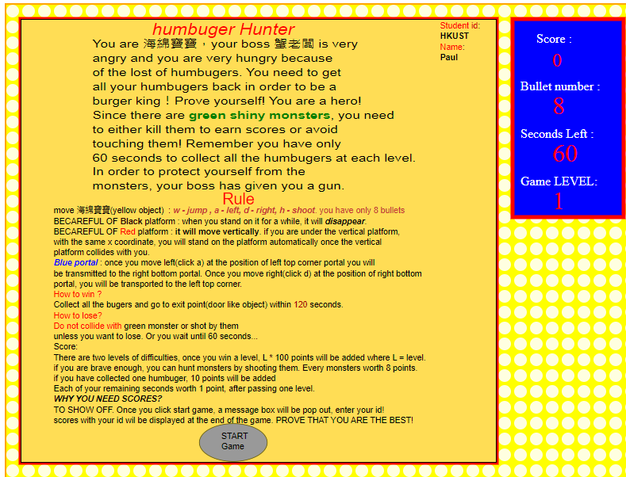

# SVG game
## Language: JavaScript, HTML, CSS, SVG.
## Browser (recommended): Chrome
## Description / Rules:  COMP4021_SVG_Proj_detail-1.pptx
```
exit Door
1. when users enter the exit door after collecting all the good things, alert of reminding message will be shown,
 after clicking "OK", next level or high score table will be loaded, depending on the current level.

portal
1. circular rotating object
2. top left corner one moves u to the bottom right corner and vise versa
3. player move left(click a ) to enter the top left corner, move right(click d) to enter the bottom right corner.

special platform
1. red rectangle -> vertical movement platform
2. black rectangle -> disappearing platform
3. when player under the red platform within the width of red rectangle (same x coordinate, right below the vertical platform)
When red platform clollides with player, player will be moved to the red rectangle ( step on the vertical platform).

Rule:
1. a -> left
2. d -> right
3. w -> jump
4. h -> shoot

Score
1. each humbuger worth 10 points
2. each monsters worth 8 points
3. each second worth 1 point

```
## How to run / view source code:
```
1. go to /SVG game code/ game.html
2. double click game.html

```
## Screen Shot
- initial page
<br/>



- game page
